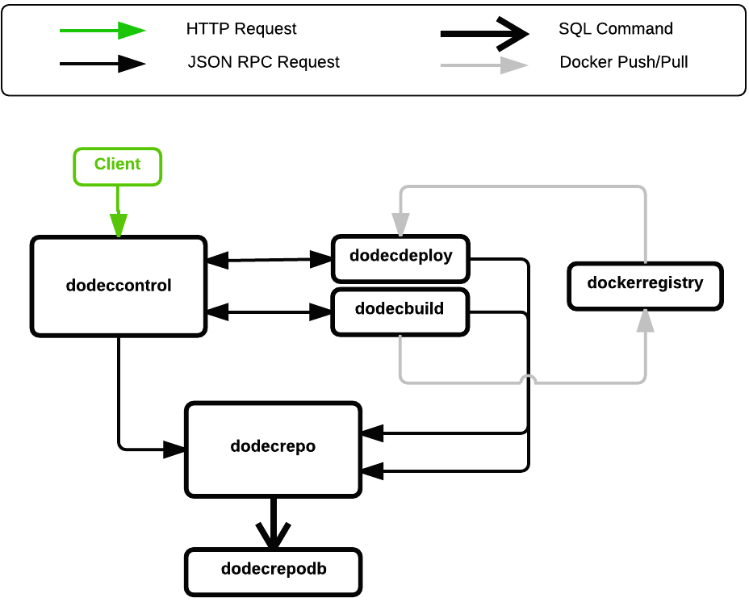

Introduction: DodecahedronCI
============================

DodecahedronCI is a continuous integration and continuous deployment server. The name "DodecahedronCI" is a rejection of a recent branding trend that favors simple shapes/primitives: Square, Squarespace, Box, Stripe, Line, CircleCI, etc. Additionally, DodecahedronCI itself is a rejection of the simple, lightweight component fad. DodecahedronCI favors complicated monolithic systems. (just kidding)

I created this project to introduce myself to the following technologies/tools:
* Go
* Docker
* Git
* GitHub
* Linux

Architecture
============

API Reference
=============

	GET /info

	POST /build

	POST /build/githubwebhook

	GET /build/(id)
	
	GET /build/(id)/logs

	POST /release

	GET /release/(id)

	POST /deploy

	GET /deploy/(id)

	GET /deploy/(id)/logs
