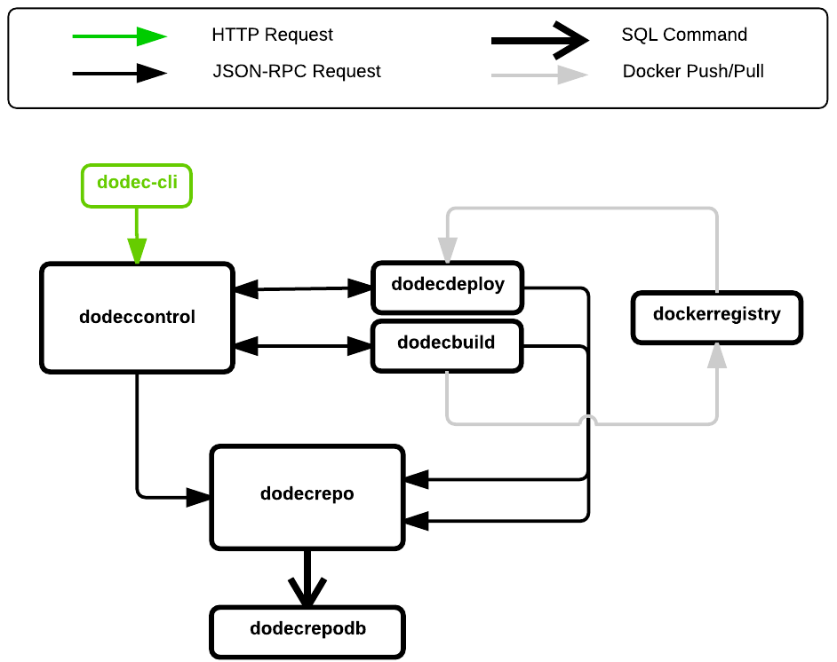

DodecahedronCI
==============
DodecahedronCI is a continuous integration and deployment server built on Docker and Git.
Through this project, I have introduced myself to the following tools and technologies:
* Go
* Docker/Fig
* PostgreSQL
* JSON-RPC
* Git
* GitHub
* Linux

Etymology
=========
The name "DodecahedronCI" is a reaction against a recent branding trend that favors simple shapes/primitives: Square, Squarespace, Box, Stripe, Line, CircleCI, etc. DodecahedronCI's governing philosophy is to reject the fad of simple, lightweight components, and favor complicated monolithic systems. (just kidding!)

Setup
=====
Prerequisites:
* [Git](http://git-scm.com/book/en/v2/Getting-Started-Installing-Git)
* [Go](https://golang.org/doc/install)
* [Docker](https://docs.docker.com/installation/)
* [Fig 1.0.1](http://www.fig.sh/install.html) (support for Compose 1.1.0 TBD)

Step 1: Get the source code.

    $ git clone https://github.com/jtakamine/dodecahedronci.git ~/go/src/github.com/jtakamine/dodecahedronci

Step 2: Get Go dependencies.

    $ cd ~/go/src/github.com/jtakamine/dodecahedronci
    $ go get -d ./...
    

Architecture
============

DodecahedronCI is composed of 6 microservices:
* [dodeccontrol](dodeccontrol/) controls dodecbuild/dodecdeploy, aggregates logs, and exposes public API.
* [dodecbuild](dodecbuild/) builds Git repos and produces releases.
* [dodecdeploy](dodecdeploy/) deploys releases.
* [dockerregistry](https://github.com/docker/docker-registry) stores docker images.
* [dodecrepo](dodecrepo/) saves/retrieves app data to/from dodecrepodb.
* [dodecrepodb](dodecrepodb/) persists app data (PostgreSQL DB).

